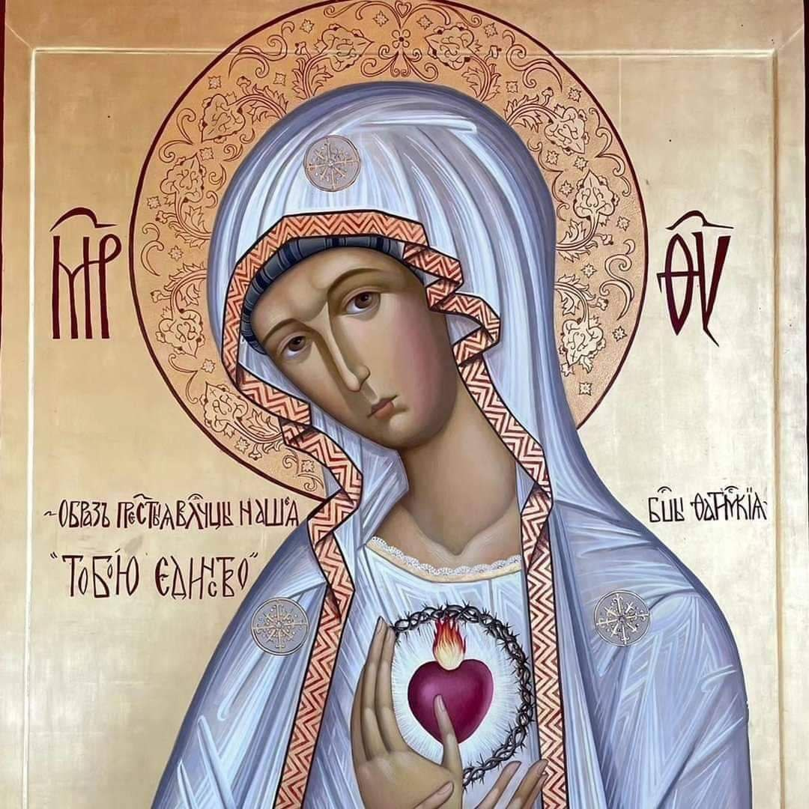

## Primera Parte: María en la Historia de la Salvación

1. **Necesidad del culto a María**

Resumen: Este capítulo explica por qué es necesario rendir culto a la Virgen María. San Luis María de Montfort argumenta que, aunque Dios no necesita de María para realizar su voluntad, ha elegido obrar sus mayores maravillas a través de ella. María es vista como un canal de gracia indispensable para los cristianos.

2. **María en el misterio de Cristo**

Resumen: Aquí se analiza el papel de María en la Encarnación y Redención. Montfort describe cómo Dios Padre, Hijo y Espíritu Santo actuaron conjuntamente con María en estos misterios. María es presentada como la Madre de Cristo y colaboradora en la obra redentora.

3. **María en el misterio de la Iglesia: misión y consecuencias**

Resumen: Este capítulo destaca la misión de María dentro de la Iglesia y sus efectos en los fieles. Se la presenta como colaboradora de Dios y dispensadora de todas las gracias. María tiene un papel continuo y crucial en la vida espiritual de los cristianos y en la lucha contra las fuerzas del mal.

4. **María en los tiempos de la Iglesia: María y los últimos tiempos**

Resumen: San Luis María de Montfort profetiza sobre el papel de María en los últimos tiempos. Asegura que María será más conocida y amada, y que jugará un rol decisivo en la victoria final sobre el mal. Los devotos a María serán especialmente fuertes en la fe y la lucha espiritual.

5. **María y la lucha final**

Resumen: Este capítulo detalla la confrontación entre el bien y el mal en los últimos tiempos, con María como líder en la batalla espiritual. Se destaca que los verdaderos devotos a María serán sus principales aliados en esta lucha.

6. **María y los apósoles de los últimos tiempos**

Resumen: Montfort describe a los apóstoles de los últimos tiempos como aquellos que estarán completamente consagrados a María. Estos apóstoles serán instrumentos de Dios para propagar la devoción mariana y luchar contra las fuerzas del mal.

## Segunda Parte: El Culto de María en la Iglesia

1. **Fundamentos teológicos**

Resumen: Se explican los fundamentos teológicos de la devoción a María, basándose en la Sagrada Escritura, la tradición y los escritos de los Padres de la Iglesia. Se argumenta que la devoción a María es una parte integral de la fe cristiana.

2. **Deformaciones del culto a María**

Resumen: Este capítulo trata sobre las posibles desviaciones y malentendidos en la devoción mariana. Montfort advierte contra las falsas devociones y enfatiza la importancia de una verdadera y auténtica devoción a la Virgen María.

3. **La verdadera devoción a la Santísima Virgen**

Resumen: Se presenta una descripción detallada de lo que constituye una verdadera devoción a María. Montfort ofrece una guía práctica para los fieles que desean consagrarse a Jesús a través de María.

4. **Diversas prácticas de devoción a María**

Resumen: Aquí se enumeran y explican diversas prácticas devocionales hacia María, incluyendo oraciones, consagraciones, y otras formas de veneración. Se destaca la importancia de integrar estas prácticas en la vida diaria de los cristianos.

## Tercera Parte: La Perfecta Consagración a Jesucristo

1. **Contenidos esenciales**

Resumen: Este capítulo define los elementos esenciales de la consagración a Jesucristo a través de María. Se explica la naturaleza de esta consagración y sus implicaciones espirituales.

2. **Motivos a favor de esta devoción**

Resumen: Montfort proporciona varias razones y beneficios de adoptar la consagración mariana. Entre ellos, se destaca la obtención de gracias especiales y una mayor unión con Jesucristo.

3. **Figura bíblica de la vida consagrada por María**

Resumen: Se utilizan figuras y ejemplos bíblicos para ilustrar la vida consagrada a María. Montfort explica cómo personajes del Antiguo y Nuevo Testamento prefiguran esta consagración.

4. **Efectos maravillosos de la consagración total**

Resumen: Aquí se detallan los efectos y frutos de una consagración total a Jesús por María. Montfort destaca las transformaciones espirituales y las gracias que reciben los fieles consagrados.

5. **Prácticas particulares de esta devoción**

Resumen: Se ofrecen sugerencias específicas sobre cómo vivir la devoción mariana en la vida diaria. Incluye oraciones, actos de consagración y otras prácticas piadosas.

6. **Práctica de esta devoción en la sagrada comunión**

Resumen: Este capítulo final explica cómo integrar la devoción mariana en la recepción de la Sagrada Comunión. Montfort subraya la importancia de recibir la Eucaristía con el espíritu de María para una mayor unión con Cristo.

