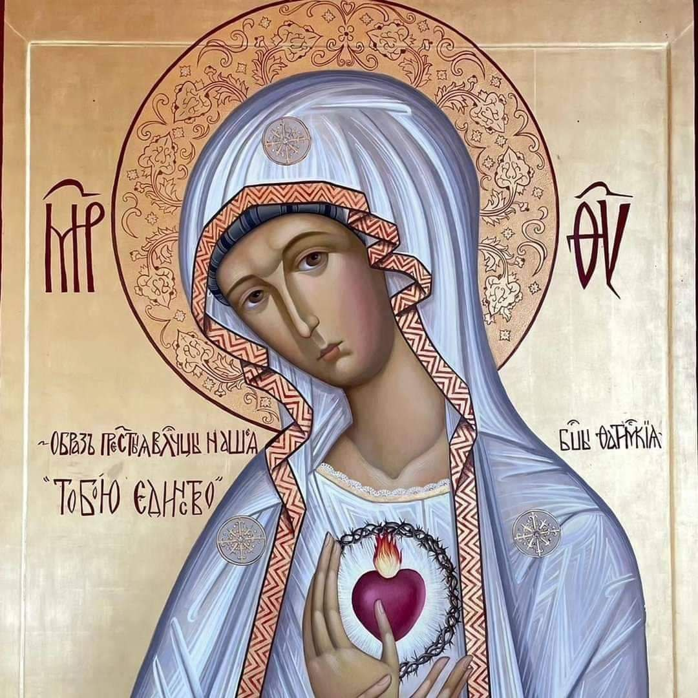

Devoción de los cinco primeros sábados en reparación al Inmaculado Corazón de María 2024.

## Introducción

La devoción de los cinco primeros sábados en reparación al Inmaculado Corazón de María es una práctica de piedad basada en una serie de apariciones marianas que tuvieron lugar en Fátima, Portugal, en 1917. El objetivo principal de esta devoción es ofrecer una reparación al Inmaculado Corazón de María por los pecados y ofensas cometidos contra ella y por la conversión de los pecadores.

## Objetivos de la Devoción de los Cinco Primeros Sábados:

1. **Reparación**: Ofrecer actos de amor y reparación al Inmaculado Corazón de María por las ofensas y pecados cometidos contra su corazón.

2. **Conversión** de los Pecadores: Pedir por la conversión de los pecadores y por la salvación de las almas.

3. **Paz en el Mundo**: Rogar por la paz en el mundo, un tema central en los mensajes de Fátima.

### Reparación:

La devoción de los cinco primeros sábados en reparación al Inmaculado Corazón de María se realiza en respuesta a cinco tipos específicos de ofensas cometidas contra el Inmaculado Corazón de María. Estas ofensas, tal como fueron reveladas a la hermana Lucía dos Santos, son las siguientes:

1. **Ofensas contra la Inmaculada Concepción**: Negar o menospreciar el dogma de la Inmaculada Concepción de María, que enseña que María fue concebida sin pecado original.

2. **Ofensas contra su virginidad perpetua**: Negar o menospreciar la virginidad perpetua de María, que enseña que María fue virgen antes, durante y después del nacimiento de Jesús.

3. **Ofensas contra su maternidad divina y espiritual**: Negar o menospreciar la maternidad divina de María, es decir, que es la Madre de Dios (Theotokos), y también su maternidad espiritual sobre todos los cristianos, como Madre de la Iglesia.

4. **Ofensas de los que inculcan en los corazones de los niños la indiferencia, el desprecio y hasta el odio hacia esta Madre Inmaculada**: Enseñar a los niños a despreciar o odiar a la Virgen María, o inculcarles una indiferencia hacia ella.

5. **Ofensas de los que la ultrajan directamente en sus sagradas imágenes**: Profanar, vandalizar o mostrar irrespeto hacia las imágenes sagradas de la Virgen María.

Estas cinco ofensas son vistas como heridas al Inmaculado Corazón de María, y la devoción de los cinco primeros sábados es una forma de reparación por estas injurias, buscando consolar y honrar a María por medio de actos de amor y devoción.

## Requisitos de la Devoción:

Para cumplir con la devoción de los cinco primeros sábados, se deben seguir estos pasos durante cinco primeros sábados consecutivos de cada mes:

1. **Confesión**: Recibir el sacramento de la confesión. Puede hacerse con varios días de antelación, siempre y cuando se esté en estado de gracia el primer sábado.

2. **Comunión**: Recibir la Sagrada Comunión en estado de gracia.

3. **Rezo del Rosario**: Rezar un rosario completo (cinco decenas).

4. **Meditación de los Misterios del Rosario**: Dedicar 15 minutos adicionales a la meditación sobre uno o varios misterios del Rosario, en espíritu de reparación.

5. **Intención**: Realizar todo esto con la intención de hacer reparación al Inmaculado Corazón de María.

## Historia y Origen:

La devoción fue revelada por la Virgen María a la hermana Lucía dos Santos, una de las videntes de Fátima, en una aparición en 1925 en Pontevedra, España. La Virgen pidió que se estableciera esta devoción para reparar las ofensas cometidas contra su Inmaculado Corazón.

## Significado Espiritual:

La devoción no solo busca la reparación, sino también fortalecer la relación personal con María y, a través de ella, con Jesucristo. Es un llamado a la conversión personal y a la intercesión por la conversión del mundo.

Esta práctica devocional se celebra en diversas partes del mundo y es promovida por la Iglesia Católica como una forma de profundizar en la fe y la devoción mariana.

## Salve Regina


