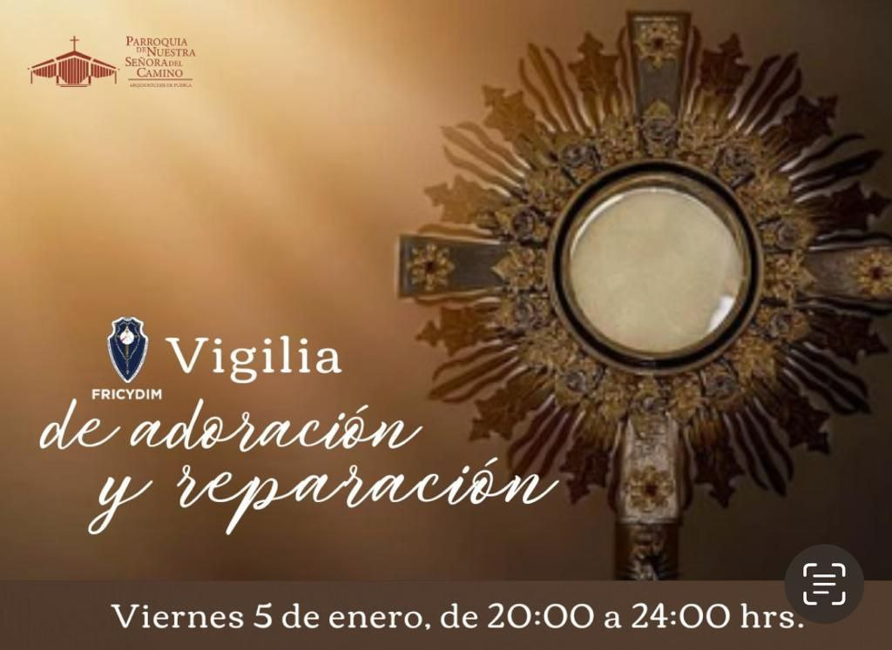

<!--  -->

## Ubicación

<iframe src="https://www.google.com/maps/embed?pb=!1m14!1m8!1m3!1d3771.8646900197145!2d-98.2428844!3d19.0256832!3m2!1i1024!2i768!4f13.1!3m3!1m2!1s0x85cfc740f9690f61%3A0x444c1cf7b6576b42!2sParroquia%20de%20Nuestra%20Se%C3%B1ora%20del%20Camino!5e0!3m2!1ses-419!2smx!4v1717370644680!5m2!1ses-419!2smx" 
    width="100%"  
    style="border:0;" 
    allowfullscreen="" 
    loading="lazy" 
    referrerpolicy="no-referrer-when-downgrade">
</iframe>
