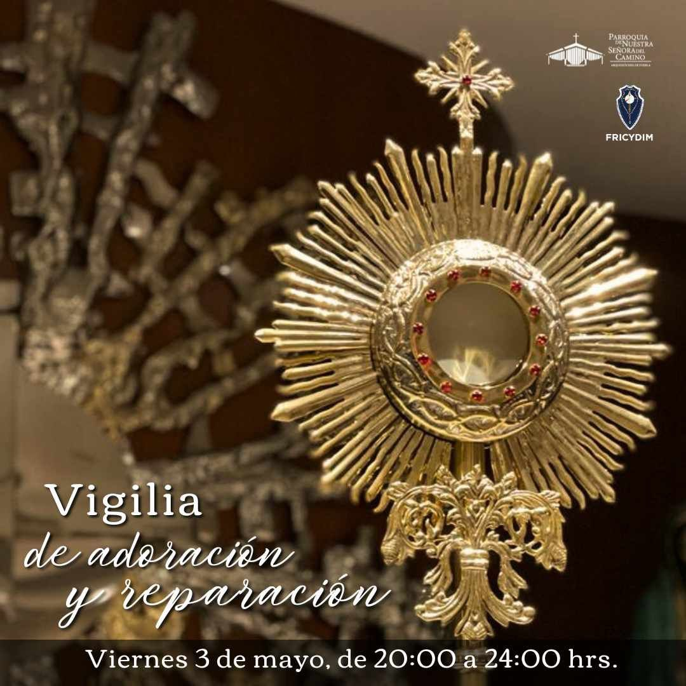

<!--  -->

## Ubicación

<iframe src="https://www.google.com/maps/embed?pb=!1m14!1m8!1m3!1d3771.8646900197145!2d-98.2428844!3d19.0256832!3m2!1i1024!2i768!4f13.1!3m3!1m2!1s0x85cfc740f9690f61%3A0x444c1cf7b6576b42!2sParroquia%20de%20Nuestra%20Se%C3%B1ora%20del%20Camino!5e0!3m2!1ses-419!2smx!4v1717370644680!5m2!1ses-419!2smx" 
    width="100%"  
    style="border:0;" 
    allowfullscreen="" 
    loading="lazy" 
    referrerpolicy="no-referrer-when-downgrade">
</iframe>

## *Esquema de la Vigilia*

### * De 20:00 a 21:00 hrs *

Dispongamos nuestros corazones amada Familia FRICYDIM-MATER FÁTIMA para  Amar, Adorar, Glorificar y  Reparar a los Sagrados Corazónes de Jesús y María.

#### Ofrecimiento de la Vigilia FRICYDIM

Ofrecimiento de la Vigilia FRICYDIM.
Reparación y Desagravio al Sagrado Corazón de Jesús y al Inmaculado Corazón de María.

Esta vigilia de adoración y reparación la ofresemos especialmente para honrar y venerar el amor y la compasión que Jesús mostró por la humanidad. Él mostró su corazón y expresó su deseo de que el amor a su Sagrado Corazón se difundiera por todo el mundo.

#### - Acuérdate al Sagrado Corazón, pag.89

Acuérdate ¡oh Sagrado Corazón de Jesús! de todo lo que has hecho por salvarnos. Acuérdate del eterno e inmenso amor que has tenido por todos los hombres; que tu Corazón acoja a los que a Ti acuden y se conmueva ante nuestras debilidades. llenos de confianza y amor, venimos a tu Corazón, como el corazón del mejor de los padres, del más fiel y bueno de los amigos. Recíbenos, ¡ oh Corazón sagrado! en tu infinita ternura; haznos sentir los efectos de tu amor; sé nuestro apoyo, nuestro mediador ante nuestro Padre, y concédenos la fuerza en nuestra debilidad, consuelo en nuestras penas, y la gracia de amarte en el tiempo y de poseerte en la eternidad. Corazón de Jesús, acudo a Ti porque eres mi refugio, mi esperanza; el remedio de todos mis males, el alivio de mis miserias, la reparación de todas mis faltas, la seguridad de todas mis peticiones, la fuente inagotable para mí, y para todos la luz, la fuerza, la constancia, la paz y la bendición. Estoy seguro que no te cansarás de mí y que no cesarás de amarme, protegerme y ayudarme, porque me amas con un amor infinito. Ten piedad de mí, según tu gran misericordia, Y haz de mí, por mí, y en mí todo lo que quieras, porque yo me abandono a tu Corazón con la ~ntera confianza de que no me abandonarás jamas. Amén.

#### - Acto de proclamación del Sagrado Corazón de Jesús como Rey de México y juramento de fidelidad y vasallaje, pag. 90-91

Corazón Sacratísimo del Rey pacífico: radiante de júbilo como fieles vasallos, venimos hoy a postranos al pie de de tu trono y gozosos te proclamamos a la faz del mundo, "Rey inmortal de la nación mexicana", al acatar tu Soberanía sobre todo los pueblos.

Queremos coronar tu frente, ¡Oh Cristo Rey!, con una diadema de corazones mexicanos, y poner en tu mano, el cetro de un poder absoluto, para que rijas y gobiemes a tu pueblo amado. Eres Rey como afirmaste en tu pasión, ¡porque eres el Hijo de Dios! Por lo tanto, oh Monarca amabilísimo!, este pueblo tuyo, que tiene hambre y sed de justicia, que se ampara en tu celestial Realeza, te promete entronizar tu Corazón en todos sus hogares, pobres o ricos, y rendirle el homenaje que mereces, reconociendo tus derechos santísimos sobre todo el orbe.

Consagramos a tu Corazón Sagrado, la Iglesia de México con todos sus Pastores, la lglesia Ministros y Comunidades religiosas; la Patria querida con todos sus hogares, las familias con todos sus miembros; ancianos, jóvenes y niños; a los ami gos y a los enemigos, y, muy particularmente, a las madres, las esposas y las hijas, destinadas a modelar el corazón del futuro pueblo mexicano, para que triunfes y reines en todos los habitantes de esta Nación.

Todos, ¡oh Cristo Rey!, con ardiente júbilo te juramos fidelidad como nobles y generosos va sallos. Habla, pues, manda reclama y exige con imperio: pídenos la sangre y la vida, que son tu yas, porque totalmente te pertenecemos; resuel tos estamos a dártelos por defender tu bandera hasta que triunfe y sea exaltado, reverenciadoy amado para siempre tu herido Corazón.

Ya reina en México tu Corazón divino y desde la santa Montaña consagrada a Ti, enjugará las lá mexican0, por que los Pastores y las ovejas, los padres y los hijos, n0s gloriamos de ser tuyos. Da nos, por fin, una santa muerte, sepultándonos en la herida preciosa de tu Corazón de amor, para resucitar en los esplendores del cielo, cantando eternamente: Corazón Santo, Méxleo tuyyo Siempre será. ¡Viva Cristo Rey, en mi corazón, en mi casa y en mi Patria! Amén. Oración de Santa Gertrudis eñor lleno de ternura y misericordia, que no grimas, restañará la a sangre, curará las heridas dedesprecias jamás las suplicas de los pecado esta República conquistada por María de Guada lupe. Tú dominarás en ella con el cetro suavísimo de tu misericordia; y en la paz como en la guerra, en la agitación como en la tranquilidad, nos ve rás con benignos ojos y extenderás tus benditas y poderosas manos para bendecirnos. Y nosotros, con todas las generaciones futuras, te aclamaremos por nuestro Rey y Salvador. Allá volarán las muche dumbres a pedirte gracias y a ofrecerte, con alma y vida, guardar tu santa Ley: y tú, Redentor amoroso de los hombres, atraea tu Co razón adorable a los peca dores para convertirlos.

Recobra tu dominio sobre tantas almas apóstatas, desorientadas y engañadas con falsas y perversas doctrinas: conserva la fe en nosotros y despréndenos de los miserables bienes del mundo; calma los odios y une los hermanos; ilumina a los ciegos; perdona a los ingratos; pero, sobre todo, concede a tu lglesia la libertad y la paz por la que tanto SUspiramos. Derrite con el fuego de tu divino pecho, misericordioso Jesús, el hielo de las almas; establece tus dominios en todos los pueblos de nuestro pais, y penetre tu caridad las cárceles, los hospitales, las escuelas, los talleres; haz un trono para Ti en cada corazón mexican0, por que los Pastores y las ovejas, los padres y los hijos, n0s gloriamos de ser tuyos. Da nos, por fin, una santa muerte, sepultándonos en la herida preciosa de tu Corazón de amor, para resucitar en los esplendores del cielo, cantando eternamente: 

**Corazón Santo, tu Reinarás ya, México tuyo Siempre será.**

¡Viva Cristo Rey, en mi corazón, en mi casa y en mi Patria! Amén.

#### - Sagrado Silencio

### * 21:00 a 22:00 hrs. *

#### - 🥈Adoración Nocturna Mexicana

#### - Manual de Adoración Nocturna

### * 22:00 a 23:00 hrs. *

#### - Acto de reparación por el tiempo perdido y las gracias desaprovechadas, pag.92

Oh Corazón glorioso del Hijo de Dios crucificado! Tú eres el océano de amor, por nosotros convertido en océano de amargura. Porque todas las penas y angustias que probaste durante tu Pasión, quisiste que de antemano traspasaran tu sensible Corazón. Pues en este mismo Corazón tuyo, henchido de amor y de dolor, oh buen Jesús, deposito yo con la más firme confianza toda la carga de mis pecados, todo el tiempo perdido, las gracias por mí despreciadas y las buenas obras omitidas, todas mis faltas interiores y exteriores, todas mis penas y mis sufrimientos y todas las debilidades de mi corazón. En tu Corazón. Señor, me refugio yo mismo para que me concedas un verdadero arrepentimiento y con él el perdón de mis pecados, unión íntima contigo y la perpetua y absoluta separacion de todo lo que no seas Tú sólo, ¡Oh Dios mío! Amén.

#### - Oración de Desagravio al Sagrado Corazón pag. 92-93

 Sagrado Corazón de Jesús, yo quiero consagrarme a Ti con todo el fervor de mi espíritu. Sobre el ara del altar en que te inmolas por mi amor, deposito todo mi ser; mi cuerpo que respetaré como templo en que Tú habitas; mi alma que cultivaré como jardín en que te recreas; mis sentidos, que guardaré como puertas de tentación; mis potencias, que abriré a las inspiraciones de tu gracia; mis pensamientos, que apartaré de las ilusiones del mundo; mis deseos, que pondré en la felicidad del Paraíso; mis virtudes que florece rán a la sombra de tu protección; mis pasiones, que se someterán al freno de tus mandamientos; y hasta mis pecados, que detestaré mientras haya odio en mi pecho, y que lloraré sin cesar mientras haya lágrimas en mis ojos. Mi corazón quiere desde hoy ser para siempre todo tuyo, así como Tú, ¡Oh Corazón divino! has querido ser siempre todo mío. Tuyo todo, tuyo siempre; no más culpas, no más tibieza. Yo te serviré por los que te ofenden; pensaré en Ti por los que te olvidan; te amaré por los que te odian; y rogaré y gemiré, y me sacrificaré por los que te blasfeman sin conocerte. Tú, que penetras los Corazones, y sabes la sinceridad de mi deseo, comunícame aquella gracia que hace al debil omnipotente, dame el triunfo del valor en las batalas de la tierra, y cíñeme la oliva de la paz en las mansiones de la gloria. Amén.

#### - Práctica de desagravio pag.93-94

Divino Corazón de Jesús, me postro humilde mente en tu divino acatamiento, renuevo el ofrecimiento de mí mismo, con el propósito de desagraviarte de las ofensas, que de mí y de los demás has recibido, con fervorosos actos de amor y fidelidad. 

Te prometo que: 

- Cuanto más calumniados sean tus misterios, más firmemente los creeré, ¡0h Divino Corazón de Jesús! 

- Cuanto más porfíe el incrédulo en quitarme la esperanza de la gloria eterna, tanto más esperaré en Ti, ¡0h Corazón de Jesús, única esperanza de los mortales!

- Cuando más resistan los humanos corazones a los impulsos de tu gracia, tanto más te amaré, ¡0h Corazón infinitamente amable de Jesús!

- Cuanto más niegue el impío y blasfeme de tu divinidad, tanto más te adoraré, ¡0h Divino Corazón de Jesús!

- Cuanto más sean olvidados y quebrantados tus Santos mandamientos, con tanta mayor fidelidad querré guardar, ¡Santísimo Corazón de Jesús!

- Cuanto más sean despreciados y descuidados tus Sacramentos, con tanto más amor y reverencia los recibiré, ¡Oh generosísimo Corazón de Jesús!

- Cuanto más sea maltratado, combatido y descuidado el Santísimo Sacramento del altar, más fe, reverencia, piedad y amor pondré en adorarlo y recibirlo en la comunión ¡0h Sagrado Corazón, misterio sagrado e insondable!

- Cuanto más desconfianza el mundo tenga de tu infinita Misericordia, más confiaré en ella y la invocaré con la certeza ciega de tu infinita solicitud, ¡Oh Corazón de Jesús, rico en Misericordia!

- Cuanto más desconocidas sean tus adorables virtudes, con tanto mayor empeño me propondré ejercitarlas, ¡Oh Corazón de Jesús, espejo de to das las virtudes!

- Cuanto más trabaje el infierno por perder las almas que Tú rescataste con tanto amor y sufrimiento, tanto más ardientemente será mi celo por salvarlas, ¡0h Corazón de Jesús, Celador de las almas!

- Cuanto más se empeñen el sensualismo y la soberbia por desarraigar del mundo el espíritu de abnegación y el cumplimiento fiel de mis obligaciones, tanto más incentivaré el espíritu de sacrificio y de abnegación, ¡Oh Corazón de Jesús, saciado de oprobios!

- Cuanto más tenazmente combatan a la lglesia las puertas del infierno, más fiel seré a ella, ¡Oh fidelísimo Corazón de Jesús!

- Cuanto más se levante el mundo contra las infalibles enseñanzas del Papa, con tanta mayor fe las atenderé, la llevaré a la práctica y con humilde sumisión me dejaré llevar de él, ¡Oh Corazón de Jesús, verdad eterna!

- Cuanto más atacada sea tu Santa Madre y Madre de los hombres, más la amaré y me confiaré a su Inmaculado Corazón, ¡Oh Sagrado Corazón de Jesús, reflejo de amor de María Santisima!

- Cuanto más desprecios el mundo haga hacia tus ministros, obispos, sacerdotes, diáconos y consagrados, más los amaré y creeré en ese admirable misterio de posesión y acción divina en ellos, ¡Oh Sagrado Corazón del Sumo y Eterno sacerdote!

- Cuanto más se dividan los hombres llevados por el egoísmo, tanto más los amaré en Ti a todos, como miembros de una misma familia, ¡Oh amorosísimo Corazón de Jesús!

**Oremos**

Sagrado Corazón de Jesús, Corazón de nuestro Dios: concédenos tu gracia y esfuérzanos con ella tan constante y firmemente, que como fieles hijos de la Iglesia, seamos tus apóstoles, acá en la tierra y después tu corona, por toda la eternidad. Amén.

#### - Acto de Consagración que hizo de sí al Sagrado Corazón Santa Margarita, pag. 86 

Corazón Sagrado de mi amado Jesús: yo, aunque vilísima criatura, te doy y consagro mi persona, vida, acciones, penas y padecimientos, deseando que ninguna parte de mi ser me sirva más que para amarte, honrarte y glorificarte. Esta es mi voluntad irrevocable; ser toda Tuya y hacerlo todo por tu amor, renunciando de todo corazón a cuanto pueda desagradarte. Te tomo, pues ¡0h Corazón Sagrado!, por el único objeto de mi amor, protector de mi vida, prenda de mi salvación, remedio de mi inconstancia, reparador de todos los defectos de mi vida, y asilo seguro en la hora de mi muerte; sé, pues, Corazón bondadoso!, mi justificación para con Dios Padre, y aleja de mi los rayos de su justa cólera.

Oh Corazón amoroso! Pongo toda mi confianza en Ti, pues aunque lo temo todo de mi debilidad, sin embargo, todo lo espero de tu Misericordia; consume en mí todo lo que te desagrada y resiste, y haz que tu puro amor se imprima tan íntimamente en mi corazón, que jamás pueda olvidarte ni ser separada de Ti. Te suplico, por tu misma bondad, escribas mi nombre en Ti mismo, pues quiero hacer consistir toda mi dicha en vivir y morir como tu esclava. Amén.

#### - Santo Rosario - Los Misterios y sus Frutos

- Misterios Gozosos, pag. 349-350

1. Primer misterio: La Anunciación del Ángel a María Santisima.

    "Y habiendo entrado el ángel a donde estaba María le dijo: Dios te salve, llena eres de gracia" (Lc 1, 28).

    - El fruto de este misterio: La humildad.

2. Segundo misterio: La Visita de la Virgen María a su Prima Sata Isabel.

    "Al oír Isabel el saludo de María, la criatura saltó de alegria en su vientre y exclamó en alta Voz: Bendita eres entre todas las mujeres y bendito es el fruto de tu vientre" (Lc 1, 41-42)

    - El fruto de este misterio: El amor al prójimo.

3. Tercer misterio: El Nacimiento del Niño Jesús en Belén.

    "Y dio a luz a su hijo primogénito y lo envolvió en pa ñales, y lo recostó en un pesebre; porque no hubo lugar para ellos en las posadas" (Lc 2, 7).

    - E fruto de este misterio: El amor a la pobreza.

4. Cuarto misterio: La Presentación del Niño Jesús en el Templo.

    "Cumplido el tiempo de la purificación, según la ley de Moisés, llevaron al niño a Jerusalén para presentarlo al Señor, como está escrito en la ley: todo primogénito varón será consagrado al Señor" (Lc 2, 22-23).

    - El fruto de este misterio: La obediencia.

5. Quinto misterio: El niño perdido y allado en el Templo.

    "Y al cabo de tres días de haberlo perdido, le hallaron en el templo, sentado en medio de los doctores de la ley oyéndoles y preguntándoles" (Lc 2, 46).

    - El fruto de este misterio: El continuo empeño por la vida de la gracia. El gozo de hallar a Jesús y vivir con Él en nuestro interior.

#### - Letanías al Inmaculado Corazón de María, pag. 347-348

Repetimos lo mismo a cada invocación:

- Señor, ten piedad.
- Cristo, ten piedad.
- Señor, ten piedad.
- Cristo, óyenos.
- Cristo, escúchanos.
- Dios Padre celestial,
- Dios Hijo Redentor del mundo,
- Dios Espíritu Santo,
- Santa Trinidad, un solo Dios, 

A cada invocación respondemos: "Ruega por nosotros". 

- Inmaculado Corazón de María,
- Corazón de María, lleno de gracia,
- Corazón de María, vaso del amor más puro,
- Corazón de María, consagrado íntegro a Dios
- Corazón de María, preservado de todo pecado,
- Corazón de María, morada de la Santísima Trinidad,
- Corazón de María, delicia del Padre en la Creación,
- Corazón de María, instrumento del Hijo en la Redención,
- Corazón de María, la esposa del Espíritu Santo,
- Corazón de María, abismo y prodigio de humildad,
- Corazón de María, mediador de todas las gracias,
- Corazón de María, latiendo al unísono con el Corazón de Jesús,
- Corazón de María, gozando siempre de la visión beatífica,
- Corazón de María, holocausto del amor divino,
- Corazón de María, abogado ante la justicia divina,
- Corazón de María, traspasado de una espada,
- Corazón de María, coronado de espinas por nuestros pecados,
- Corazón de María, agonizando en la Pasión de tu Hijo,
- Corazón de María, exultando en la resurrección de tu Hijo,
- Corazón de María, triunfando eternamente con Jesús,
- Corazón de María, fortaleza de los cristianos,
- Corazón de María, refugio de los perseguidos,
- Corazón de María, esperanza de los pecadores,
- Corazón de María, consuelo de los moribundos,
- Corazón de María, alivio de los que sufren,
- Corazón de María, lazo de unión con Cristo,
- Corazón de María, camino seguro al Cielo,
- Corazón de María, prenda de paz y santidad,
- Corazón de María, vencedora de las herejas,
- Corazón de María, de la Reina de Cielos y Tiera,
- Corazón de María, de la Madre de Dios y de la Iglesia,
- Corazón de María, que por fin triunfarás,

V. Cordero de Dios que quitas el pecado del mundo,

R. Perdónanos Señor.

V. Cordero de DioS que quitas el pecado del mundo,

R. Escúchanos Señor.

V. Cordero de Dios que quitas el pecado del mundo,

R. Ten misericordia de nosotros.

V. Ruega por nosotros Santa Madre de Dios,

R. Para que seamos dignos de alcanzar las promesas de nuestro Señor Jesucristo.

Oremos:

Tú que nos has preparado en el Corazón Inmaculado
de María una digna morada de tu Hijo Jesucristo,
concédenos la gracia de vivir siempre conformes
a sus enseñanzas y de cumplir sus deseos. 
Por Cristo tu Hijo, nuestro Señor. Amén. 

#### - Acto de Ofrecimiento y Consagración al Inmaculado Corazón de María, (San Juan Pablo II), pag. 346-347

(Texto enviado por el Santo Padre a todos los obispos para realizar la Consagracion, que fue el que pronunció en Roma el 25 de marzo de 1984, para responder al pedido de la Virgen a Fátima)

La familia es el corazón de la lglesia. Surja hoy de este corazón un acto de consagración especial al Corazón de la Madre de Dios. En el año Jubilar de la Redención queremos confesar que el Amor es mas grande que el pecado y que todo mal que amenaza al hombre y al mundo. Con humildad invoquemos este Amor: "Nos acogemos a tu protección, Santa Madre de Dios".

Pronunciando las palabras de esta antífona, con la que la lglesia de Cristo reza desde hace siglos, nos encontramos hoy ante Ti, Madre, en el Año Jubilar de nuestra Redención.

Estamos unidos a todos los Pastores de la Iglesia con un vínculo particular, formando un cuerpo y un colegio con Pedro.

En el vínculo de esa unidad, pronunciamos las palabras de este Acto, en el que deseamos recoger, una vez más, las esperanzas y las angustias de la lglesia en el mundo contemporáneo.

Hace cuarenta años, y nuevamente diez años después, tu siervo el Papa Pío XII, teniendo presentes las experiencias dolorosas de la familia humana, confió y consagró a tu Corazón Inmaculado todo el mundo, y especialmente los pueblos que, debido a su situación, son objeto particular de tu amor y solicitud.

Este mundo de los hombres y de las naciones es el que tenemos ante los ojos también hoy: el mundo del segundo milenio que está finalizando, el mundo contemporáneo, nuestro mundo.

La lglesia, recordando las palabras del Señor: "ld, pues, enseñad a todas las gentes... Yo estaré con ustedes siempre hasta la consumación del mundo' (Mt 18, 19-20), ha avivado en el Concilio Vaticano II su conciencia de su misión en este mundo.

Y por esto, oh Madre de los hombres y de los pueblos, tú que conoces todos sus sufrimientos y esperanzas, tú que sientes maternalmente todas las luchas entre el bien y el mal, entre la luz y las tinieblas que invaden el mundo contemporáneo, acoge nuestro grito que, movidos por el Espíritu Santo, elevamos directamente a tu Corazón: abraza con amor de Madre y de Sierva del Señor este mundo humano nuestro, que te confiamos y consagramos, llenos de inquietud por la suerte terrena y eterna de los hombres y de los pueblos.

De modo especial confiamos y consagramos aquellos hombres y aquellas naciones, que tienen necesidad particular de esta entrega y de esta consagración.

"¡Nos acogemos a tu protección, Santa Madre de Dios! ¡No deseches las súplicas que te dirigimos en nuestras necesidades!"

He aquí que, encontrándonos hoy ante Ti, Madre de Cristo, ante tu Corazón Inmaculado, deseamos, junto con toda la Iglesia, unirnos a la consagración que, por nuestro amor, tu Hijo hizo de sí mismo al Padre cuando dijo: 'Yo por ellos me santifico, para que ellos sean santificados en verdad' (Jn 17, 19). Queremos unirnos a nuestro Redentor en esta consagración por el mundo y por los hombres, la cual, en su Corazón divino, tiene el poder de conseguir el perdón y procurar la reparación.

El poder de esta consagración dura por siempre, abarca a todos los hombres, pueblos y naciones, y supera todo el mal que el espíritu de las tinieblas es capaz de sembrar en el corazón del hombre y en su historia; y que, de hecho, ha sembrado en nuestro tiempo.

¡0h, cuán profundamente sentimos la necesidad de consagración para la humanidad y para el mundo: para nuestro mundo contemporáneo, en unión con Cristo mismo! En efecto, la obra redentora de Cristo debe ser participada por el mundo a través de la lglesia.

Lo manifiesta el presente Año de la Redención, el Jubileo extraordinario de toda la lglesia.

En este Año Santo, bendita seas por encima de todas las creaturas, Tú. Sierva del Señor, que de manera más plena obedeciste la llamada divina.

Te saludamos a Ti, que estás totalmente unida a la consagración redentora de tu Hijo.

Madre de la Iglesia, ilumina el pueblo de Dios en los caminos de la fe, de la esperanza y de la caridad. Ilumina especialmente a los pueblos de los que Tú esperas nuestra consagración y nuestro ofrecimiento. Ayúdanos a vivir en la verdad de a consagración de Cristo por toda la familia humana del mundo actual.

Al encomendarte, oh Madre, el mundo, todos los hombres y pueblos, te confiamos también la misma consagración del mundo, poniéndola en tu Corazón maternal.

¡Corazón Inmaculado! Ayúdanos a vencer la amenaza del mal, que tan fácilmente se arraiga en los corazones de los hombres de hoy y que con sus efectos inconmensurables pesa ya sobre la vida presente y da la impresión de cerrar el camino hacia el futuro.

¡Del hambre y de la guerra, libranos!

¡De la guerra nuclear, de la autodestrucción incalculable y de todo tipo de guerra, líbranos!

¡De los pecados contra la vida del hombre desde su primer instante, líbranos!

¡Del odio y del envilecimiento de la dignidad de los hijos de Dios, líbranos!

¡De toda clase de injusticias en la vida social, nacional e internacional, líbranos!

¡De la facilidad de pisotear los mandamientos de la ley de Dios, líbranos!

¡De la tentativa de ofuscar en los corazones humanos la verdad misma de Dios, líbranos!

¡Del extravío de la conciencia del bien y del mal, líbranos!

¡De los pecados contra el Espíritu Santo, líbranos! ¡Líbranos!

Acoge, oh Madre de Cristo, este grito lleno del sufrimiento de todos los hombres. Lleno del sufrimiento de sociedades enteras

Ayúdanos con el poder del Espíritu Santo a vencer todo pecado, el pecado del hombre y el "pecado del mundo", el pecado en todas sus ma nifestaciones.

Aparezca, una vez más, en la historia del mundo el infinito poder salvador de la Redención: poder del Amor misericordioso. Que éste detenga el mal. Que transforme las conciencias. Que en tu Corazón Inmaculado se abra a todos la luz de la Esperanza. Amén.

#### - Sagrado Silencio

#### - Agradecimiento y Despedida

- Actos de gratitud, pag. 112

Oh Jesús, te doy rendidas gracias por los beneficios que me has dado. Yo no sabré nunca contarlos sino en el cielo, y allí te los agradeceré eternamente.

Padre Celestial, te los agradezco por tu Santísimo Hijo Jesús.

Espíritu Santo que me inspíras estos sentimientos, a Ti sea dado todo honor y toda gloria.

Jesús mío, te doy gracias sobre todo por haberme redimido. Por haberme hecho cristiano mediante el Bautismo, cuyas promesas renuevo.

Por haberme dado por Madre a tu misma Madre. Por haberme dado un grande amor a tan tierna Madre. Por haberme dado por Protector a San José, tu Padre adoptivo. Por haberme dado al Ángel de mi Guarda. Por haberme Conservado hasta ahora la vida para hacer penitencia. Por tener estos deseos de amarte y de vivir y morir en tu gracia. Amén.

- Actos de súplica pag. 113

Te ruego, Jesús mío, que no me dejes, porque me perderé. Que persevere siempre en tu amor. Que estés siempre conmigo, sobre todo cuando esté en peligro de pecar, y en la hora de mi muerte. Que no permitas que jamás me aparte de Ti. Que sepa padecer con resignación por Ti. Que no me preocupe sino de amarte. Que ame también a mis prójímos, a los pecadores, a los pobres y a los enfermos.

Que ame mucho también a las almas del Purgatorio y que saque muchas almas de allí con mis obras y oraciones, que te las ofrezco con este fin. Te pido Señor que ampares a tu lglesia, al Papa que es tu Vicario visible en la tierra; a los Obispos y a los Sacerdotes, Religiosos y Religiosas.

Te pido amor, Señor, a los que mandan en tu nombre; a los que gobiernan nuestra nación; a nuestra querida patria. A mis amados parientes y allegados.

Que pagues a mis bienhechores con tu gracia. Que favorezcas a los que ruegan por mí. Que bendigas a los que me miren con indiferencia y no me quieran. Que trabaje mucho por Ti hasta la muerte. Que me concedas una muerte santa.

Que diga al morir: ¡Jesús, Misericordia! ¡Jesús, en Ti confío! Que me lleves al cielo cuando muera. Amén.

- Oración Final. pag. 113

Jesús mío, dame tu bendición antes de salir, y que el recuerdo de esta visita, que acabo de hacerte, persevere en mi memoria y me anime a amarte más y más. Haz que cuando vuelva a visitarte, vuelva más santo. Aquí te dejo mi corazón para que te adore constantemente y lo hagas más agradable a tus divinos ojos. Pido a mi ángel de la Guarda que se quede en mi lugar, ya que no puedo continuar ahora, para seguir acompañándote, amándote y adorándote. Amén.

#### Sagrado Silencio 

### * 24:00 hrs *

#### Finaliza la Vigilia.

Al final...mi Inmaculado Corazón triunfará.